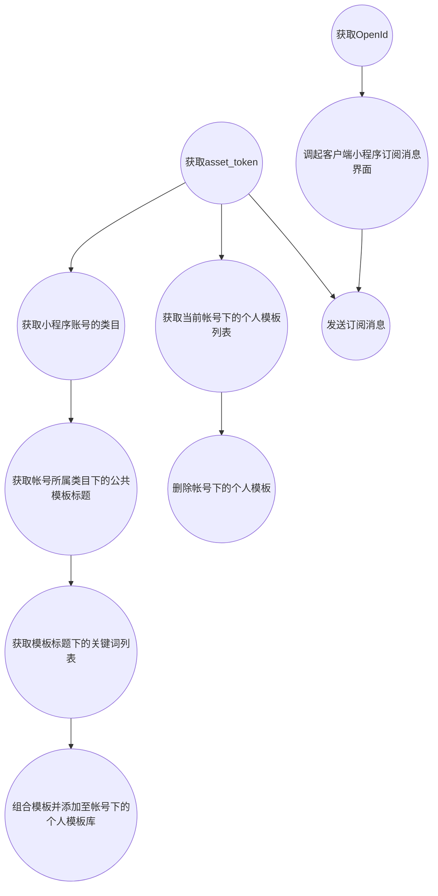

### Asp .NetCore 微信小程序获取AccessToken、订阅消息

> 微信开放文档 https://developers.weixin.qq.com/miniprogram/dev/api-backend/open-api/subscribe-message/subscribeMessage.addTemplate.html

#### 环境

- .Net Core 6.0

#### 工具

- Visual Studio 2022
- 微信开发者工具

#### 效果

至于样式效果取决于模板选择


#### 流程

可能大概也许流程是这样子的，看看就行了，不必要当真🤭。



##### 新建项目

我这里是这样新建的，当然也可以使用Visual Studio中的可视化新建。

``` shell
dotnet new webapi --name AspNetCoreWeChatSubscribeMessage
```

##### 添加依赖

编辑```.csproj```文件。

``` xml
<Project Sdk="Microsoft.NET.Sdk.Web">

  <PropertyGroup>
    <TargetFramework>net6.0</TargetFramework>
    <Nullable>enable</Nullable>
    <ImplicitUsings>enable</ImplicitUsings>
  </PropertyGroup>

  <ItemGroup>
    <PackageReference Include="Microsoft.AspNetCore.Mvc.NewtonsoftJson" Version="6.0.4" />
  </ItemGroup>

</Project>
```

##### 新增WeChat类进行封装

新建WeChat.cs文件。

``` csharp
using Newtonsoft.Json;
using System.Net.Http.Headers;
using System.Security.Cryptography;
using System.Text;

namespace AspNetCoreWeChatSubscribeMessage
{

    public class WeChat
    {
        /// <summary>
        /// 小程序 appId
        /// </summary>
        public string appid { get; set; }
        /// <summary>
        /// 小程序 appSecret
        /// </summary>
        public string secret { get; set; }
        public class Code2SessionResult
        {
            /// <summary>
            /// 用户唯一标识
            /// </summary>
            public string? openid { get; set; }
            /// <summary>
            /// 会话密钥
            /// </summary>
            public string? session_key { get; set; }

            /// <summary>
            /// 用户在开放平台的唯一标识符，若当前小程序已绑定到微信开放平台帐号下会返回，详见 UnionID 机制说明。
            /// </summary>
            public string? unionid { get; set; }
            /// <summary>
            /// 错误码
            /// </summary>
            public int errcode { get; set; }
            /// <summary>
            ///  错误信息
            /// </summary>
            public string? errmsg { get; set; }
        }
        public enum Gender
        {
            unkown = 0,
            man = 1,
            woman = 2
        }
        public class UserInfo
        {
            public string? openId { get; set; }
            /// <summary>
            /// 用户昵称
            /// </summary>
            public string? nickName { get; set; }
            /// <summary>
            /// 用户性别
            /// </summary>
            public Gender? gender { get; set; }
            /// <summary>
            /// 用户所在国家
            /// </summary>
            public string? country { get; set; }
            /// <summary>
            /// 用户所在省份。
            /// </summary>
            public string? province { get; set; }
            /// <summary>
            /// 用户所在城市。
            /// </summary>
            public string? city { get; set; }
            /// <summary>
            /// 用户在开放平台的唯一标识符，若当前小程序已绑定到微信开放平台帐号下会返回，详见 UnionID 机制说明。
            /// </summary>
            public string? unionId { get; set; }
            /// <summary>
            /// 用户头像图片的 URL。URL 最后一个数值代表正方形头像大小（有 0、46、64、96、132 数值可选，0 代表 640x640 的正方形头像，46 表示 46x46 的正方形头像，剩余数值以此类推。默认132），用户没有头像时该项为空。若用户更换头像，原有头像 URL 将失效。
            /// </summary>
            public string? avatarUrl { get; set; }
            /// <summary>
            /// 
            /// </summary>
            public Watermark? watermark { get; set; }
        }
        public class Watermark
        {
            /// <summary>
            /// 敏感数据归属 appId，开发者可校验此参数与自身 appId 是否一致
            /// </summary>
            public string? appid { get; set; }
            /// <summary>
            /// 敏感数据获取的时间戳, 开发者可以用于数据时效性校验
            /// </summary>
            public string? timestamp { get; set; }
        }
        /// <summary>
        /// 小程序类别
        /// </summary>


        public class GetAccessTokenResult
        {
            /// <summary>
            /// 获取到的凭证
            /// </summary>
            public string? access_token { get; set; }
            /// <summary>
            /// 凭证有效时间，单位：秒。目前是7200秒之内的值。
            /// </summary> 
            public long expires_in { get; set; }
            /// <summary>
            /// 错误码
            /// </summary>
            public long errcode { get; set; }
            /// <summary>
            /// 错误信息
            /// </summary>
            public string? errmsg { get; set; }
        }


        public class GetCategoryDataResult
        {

            /// <summary>
            /// 类目id，查询公共库模版时需要
            /// </summary>
            public long id { get; set; }
            /// <summary>
            /// 类目的中文名
            /// </summary>
            public string? name { get; set; }
        }
        public class GetCategoryResult
        {
            /// <summary>
            /// 错误码
            /// </summary>
            public long errcode { get; set; }
            /// <summary>
            /// 错误信息
            /// </summary>
            public string? errmsg { get; set; }
            /// <summary>
            /// 类目列表
            /// </summary>
            [JsonProperty(NullValueHandling = NullValueHandling.Ignore)]
            public List<GetCategoryDataResult>? data { get; set; }
        }
        public class GetTemplateListResult
        {
            /// <summary>
            /// 错误码
            /// </summary>
            public long errcode { get; set; }
            /// <summary>
            /// 错误信息
            /// </summary>
            public string? errmsg { get; set; }
            /// <summary>
            /// 个人模板列表
            /// </summary>
            public List<GetTemplateListDataResult>? data { get; set; }
        }
        public class GetTemplateListDataResult
        {
            /// <summary>
            /// 添加至帐号下的模板 id，发送小程序订阅消息时所需
            /// </summary>
            public string? priTmplId { get; set; }
            /// <summary>
            /// 模版标题
            /// </summary>
            public string? title { get; set; }
            /// <summary>
            /// 模版内容
            /// </summary>
            public string? content { get; set; }
            /// <summary>
            /// 模板内容示例
            /// </summary>
            public string? example { get; set; }
            /// <summary>
            /// 模版类型，2 为一次性订阅，3 为长期订阅
            /// </summary>
            public long type { get; set; }
            /// <summary>
            /// 枚举参数值范围
            /// </summary>
            public List<KeywordEnumValueResult>? keywordEnumValueList { get; set; }
        }
        public class KeywordEnumValueResult
        {

            /// <summary>
            /// 枚举参数的 key
            /// </summary>
            public string? keywordCode { get; set; }
            /// <summary>
            /// 枚举参数值范围列表
            /// </summary>
            public List<string>? enumValueList { get; set; }
        }

        public class GetPubTemplateTitleListDataResult
        {
            /// <summary>
            /// 模版标题 id
            /// </summary>
            public long tid { get; set; }
            /// <summary>
            /// 模版标题
            /// </summary>
            public string? title { get; set; }
            /// <summary>
            ///  模版类型，2 为一次性订阅，3 为长期订阅
            /// </summary>
            public long type { get; set; }
            /// <summary>
            /// 模版所属类目 id
            /// </summary>
            public long categoryId { get; set; }
        }
        public class GetPubTemplateTitleListResult
        {
            /// <summary>
            /// 错误码
            /// </summary>
            public long errcode { get; set; }
            /// <summary>
            /// 错误信息
            /// </summary>
            public string? errmsg { get; set; }
            /// <summary>
            /// 模版标题列表总数
            /// </summary>
            public long count { get; set; }
            /// <summary>
            /// 模板标题列表
            /// </summary>
            public List<GetPubTemplateTitleListDataResult>? data { get; set; }
        }

        public class GetPubTemplateKeyWordsByIdDataResult
        {
            /// <summary>
            ///  关键词 id，选用模板时需要
            /// </summary>
            public long kid { get; set; }
            /// <summary>
            ///  关键词内容
            /// </summary>
            public string? name { get; set; }
            /// <summary>
            ///  关键词内容对应的示例
            /// </summary>
            public string? example { get; set; }
            /// <summary>
            /// 参数类型
            /// </summary>
            public string? rule { get; set; }
        }
        public class GetPubTemplateKeyWordsByIdResult
        {
            /// <summary>
            /// 错误码
            /// </summary>
            public long errCode { get; set; }
            /// <summary>
            /// 错误信息
            /// </summary>
            public string? errMsg { get; set; }
            /// <summary>
            /// 模版标题列表总数
            /// </summary>
            public long count { get; set; }
            /// <summary>
            /// 关键词列表
            /// </summary>
            public List<GetPubTemplateKeyWordsByIdDataResult>? data { get; set; }
        }
        public class AddTemplateParamter
        {
            /// <summary>
            /// 模板标题 id，可通过接口获取，也可登录小程序后台查看获取
            /// </summary>
            public string? tid { get; set; }
            /// <summary>
            /// 开发者自行组合好的模板关键词列表，关键词顺序可以自由搭配（例如[3, 5, 4] 或[4, 5, 3]），最多支持5个，最少2个关键词组合
            /// </summary>
            public List<long>? kidList { get; set; }
            /// <summary>
            /// 服务场景描述，15个字以内
            /// </summary>
            public string? sceneDesc { get; set; }
        }
        public class AddTemplateResult
        {

            /// <summary>
            /// 错误码
            /// 200014	模版 tid 参数错误	
            /// 200020	关键词列表 kidList 参数错误	
            /// 200021	场景描述 sceneDesc 参数错误	
            /// 200011	此账号已被封禁，无法操作	
            /// 200013	此模版已被封禁，无法选用	
            /// 200012	个人模版数已达上限，上限25个
            /// </summary>
            public long errCode { get; set; }
            /// <summary>
            /// 错误信息
            /// </summary>
            public string? errMsg { get; set; }
        }

        public class DeleteTemplateResult
        {
            /// <summary>
            /// 错误码
            /// </summary>
            public long errCode { get; set; }
            /// <summary>
            /// 错误信息
            /// </summary>
            public string? errMsg { get; set; }
        }

        public class DeleteTemplateParamter
        {
            /// <summary>
            /// 要删除的模板id
            /// </summary>
            public string priTmplId { get; set; }
            public DeleteTemplateParamter(string priTmplId)
            {
                this.priTmplId = priTmplId;
            }
        }

        public class SubscribeMessageSendParamter
        {
            /// <summary>
            ///  接收者（用户）的 openid
            /// </summary>
            public string? touser { get; set; }
            /// <summary>
            /// 所需下发的订阅模板id
            /// </summary>
            public string? template_id { get; set; }
            /// <summary>
            /// 点击模板卡片后的跳转页面，仅限本小程序内的页面。支持带参数,（示例index? foo = bar）。该字段不填则模板无跳转。
            /// </summary>
            public string? page { get; set; }
            /// <summary>
            /// 模板内容，格式形如 { "key1": { "value": any }, "key2": { "value": any } }
            /// </summary>
            public object? data { get; set; }
            /// <summary>
            /// 跳转小程序类型：developer为开发版；trial为体验版；formal为正式版；默认为正式版
            /// </summary>
            public string? miniprogram_state { get; set; }
            /// <summary>
            ///  进入小程序查看”的语言类型，支持zh_CN(简体中文)、en_US(英文)、zh_HK(繁体中文)、zh_TW(繁体中文)，默认为zh_CN
            /// </summary>
            public string? lang { get; set; }
        }

        public class SubscribeMessageSendResult
        {
            /// <summary>
            /// 错误码
            /// </summary>
            public long errCode { get; set; }
            /// <summary>
            /// 错误信息
            /// </summary>
            public string? errMsg { get; set; }
        }

        public WeChat(string appid, string secret)
        {
            this.appid = appid;
            this.secret = secret;
        }
        /// <summary>
        /// 登录凭证校验。通过 wx.login 接口获得临时登录凭证 code 后传到开发者服务器调用此接口完成登录流程。更多使用方法详见 小程序登录。
        /// https://developers.weixin.qq.com/miniprogram/dev/framework/open-ability/login.html
        /// </summary>
        /// <param name="js_code">登录时获取的 code</param>
        /// <param name="grant_type">授权类型，此处只需填写 authorization_code</param>
        /// <returns></returns>
        public async Task<Code2SessionResult?> GetCode2Session(string js_code, string? grant_type = "authorization_code")
        {
            var result = await Get($"https://api.weixin.qq.com/sns/jscode2session?appid={appid}&secret={secret}&js_code={js_code}&grant_type={grant_type}");
            return JsonConvert.DeserializeObject<Code2SessionResult>(result);
        }
        /// <summary>
        /// 解密获取用户信息 (不验证签名)
        /// </summary>
        /// <param name="iv">加密算法的初始向量</param>
        /// <param name="encryptedData">包括敏感数据在内的完整用户信息的加密数据</param>
        /// <param name="session_key">会话密钥</param> 
        /// <returns></returns>
        public UserInfo? GetUserInfo(string iv, string encryptedData, string session_key)
        {
            return JsonConvert.DeserializeObject<UserInfo>(AESDecrypt(encryptedData, session_key, iv));
        }
        /// <summary>
        /// 解密获取用户信息 (验证签名)
        /// </summary>
        /// <param name="iv">加密算法的初始向量</param>
        /// <param name="encryptedData">包括敏感数据在内的完整用户信息的加密数据</param>
        /// <param name="session_key">会话密钥</param>
        /// <param name="rawData">不包括敏感信息的原始数据字符串，用于计算签名</param>
        /// <param name="signature">使用 sha1( rawData + sessionkey ) 得到字符串，用于校验用户信息</param>
        /// <returns></returns>
        public UserInfo? GetUserInfo(string iv, string encryptedData, string session_key, string rawData, string signature)
        {
            CheckSignature(rawData, session_key, signature);
            return GetUserInfo(iv, encryptedData, session_key);
        }


        /// <summary>
        /// 获取小程序全局唯一后台接口调用凭据（access_token）。调用绝大多数后台接口时都需使用 access_token，开发者需要进行妥善保存。 如使用云开发，可通过云调用免维护 access_token 调用。
        /// </summary>
        /// <param name="grant_type">填写 client_credential</param>
        /// <returns></returns>
        public async Task<GetAccessTokenResult?> GetAccessToken(string grant_type = "client_credential")
        {
            var result = await Get($"https://api.weixin.qq.com/cgi-bin/token?grant_type={grant_type}&appid={appid}&secret={secret}");
            return JsonConvert.DeserializeObject<GetAccessTokenResult>(result);
        }
        /// <summary>
        /// 获取小程序账号的类目
        /// </summary>
        /// <param name="access_token">接口调用凭证</param>
        /// <returns></returns>
        /// <exception cref="ArgumentNullException"></exception>
        public async Task<GetCategoryResult?> GetCategory(string access_token)
        {
            var result = await Get($"https://api.weixin.qq.com/wxaapi/newtmpl/getcategory?access_token={access_token}");
            return JsonConvert.DeserializeObject<GetCategoryResult>(result);
        }
        /// <summary>
        /// 获取帐号所属类目下的公共模板标题
        /// </summary>
        /// <param name="access_token">接口调用凭证</param>
        /// <param name="ids">类目 id，多个用逗号隔开</param>
        /// <param name="start">用于分页，表示从 start 开始。从 0 开始计数。</param>
        /// <param name="limit">用于分页，表示拉取 limit 条记录。最大为 30</param>
        /// <returns></returns>
        public async Task<GetPubTemplateTitleListResult?> GetPubTemplateTitleList(string access_token, string ids, long start = 0, long limit = 30)
        {
            var result = await Get($"https://api.weixin.qq.com/wxaapi/newtmpl/getpubtemplatetitles?access_token={access_token}&ids={ids}&start={start}&limit={limit}");
            return JsonConvert.DeserializeObject<GetPubTemplateTitleListResult>(result);
        }
        /// <summary>
        /// 获取模板标题下的关键词列表
        /// </summary>
        /// <param name="access_token">接口调用凭证</param>
        /// <param name="tid">模板标题 id，可通过接口获取</param>
        /// <returns></returns>
        public async Task<GetPubTemplateKeyWordsByIdResult?> GetPubTemplateKeyWordsById(string access_token, string tid)
        {
            var result = await Get($"https://api.weixin.qq.com/wxaapi/newtmpl/getpubtemplatekeywords?access_token={access_token}&tid={tid}");
            return JsonConvert.DeserializeObject<GetPubTemplateKeyWordsByIdResult>(result);
        }
        /// <summary>
        /// 获取当前帐号下的个人模板列表
        /// </summary>
        /// <param name="access_token">接口调用凭证</param>
        /// <returns></returns>
        public async Task<GetTemplateListResult?> GetTemplateList(string access_token)
        {
            var result = await Get($"https://api.weixin.qq.com/wxaapi/newtmpl/gettemplate?access_token={access_token}");
            return JsonConvert.DeserializeObject<GetTemplateListResult>(result);
        }
        /// <summary>
        /// 组合模板并添加至帐号下的个人模板库
        /// </summary>
        /// <param name="access_token">接口调用凭证</param>
        /// <param name="addTemplateParamter"></param>
        /// <returns></returns>
        public async Task<AddTemplateResult?> AddTemplate(string access_token, AddTemplateParamter addTemplateParamter)
        {
            var result = await Post($"https://api.weixin.qq.com/wxaapi/newtmpl/addtemplate?access_token={access_token}", addTemplateParamter);
            Console.WriteLine(result);
            return JsonConvert.DeserializeObject<AddTemplateResult>(result);
        }

        /// <summary>
        /// 删除帐号下的个人模板
        /// </summary>
        /// <param name="access_token">接口调用凭证</param>
        /// <param name="priTmplId">要删除的模板id</param>
        /// <returns></returns>
        public async Task<DeleteTemplateResult?> DeleteTemplate(string access_token, string priTmplId)
        {
            var result = await Post($"https://api.weixin.qq.com/wxaapi/newtmpl/deltemplate?access_token={access_token}", new DeleteTemplateParamter(priTmplId));
            return JsonConvert.DeserializeObject<DeleteTemplateResult>(result);
        }
        /// <summary>
        /// 发送订阅消息
        /// </summary>
        /// <param name="access_token"></param>
        /// <param name="subscribeMessageSendParamter"></param>
        /// <returns></returns>
        public async Task<SubscribeMessageSendResult?> Send(string access_token, SubscribeMessageSendParamter subscribeMessageSendParamter)
        {
            var result = await Post($"https://api.weixin.qq.com/cgi-bin/message/subscribe/send?access_token={access_token}", subscribeMessageSendParamter);
            return JsonConvert.DeserializeObject<SubscribeMessageSendResult>(result);
        }


        /// <summary>
        /// Get 请求
        /// </summary>
        /// <param name="url"></param>
        /// <returns></returns>
        static async Task<string> Get(string url)
        {
            var httpClient = new HttpClient();
            HttpResponseMessage response = await httpClient.GetAsync(url);
            return await response.Content.ReadAsStringAsync(); ;
        }
        /// <summary>
        /// Post 请求
        /// </summary>
        /// <param name="url"></param>
        /// <returns></returns>
        static async Task<string> Post(string url, object? body = null)
        {
            var httpClient = new HttpClient();
            Console.WriteLine(JsonConvert.SerializeObject(body));
            var content = new StringContent(JsonConvert.SerializeObject(body));
            content.Headers.ContentType = new MediaTypeHeaderValue("application/json");
            HttpResponseMessage response = await httpClient.PostAsync(url, content);
            return await response.Content.ReadAsStringAsync();
        }
        /// <summary>
        /// 检查签名
        /// </summary>
        /// <param name="rawData">不包括敏感信息的原始数据字符串，用于计算签名</param>
        /// <param name="session_key"></param>
        /// <param name="signature">使用 sha1( rawData + sessionkey ) 得到字符串，用于校验用户信息</param>
        /// <exception cref="Exception"></exception>
        static void CheckSignature(string rawData, string session_key, string signature)
        {
            Console.WriteLine(SHA1Encryption(rawData + session_key));
            Console.WriteLine(signature);
            if (SHA1Encryption(rawData + session_key).ToUpper() != signature.ToUpper())
            {
                throw new Exception("CheckSignature 签名校验失败，数据可能损坏。");
            }
        }
        /// <summary>  
        /// SHA1 加密，返回大写字符串  
        /// </summary>  
        /// <param name="content">需要加密字符串</param>  
        /// <param name="encode">指定加密编码</param>  
        /// <returns>返回40位大写字符串</returns>  
        static string SHA1Encryption(string content, Encoding? encode = null)
        {
            try
            {
                if (encode == null) encode = Encoding.UTF8;
                SHA1 sha1 = SHA1.Create();
                byte[] bytes_in = encode.GetBytes(content);
                byte[] bytes_out = sha1.ComputeHash(bytes_in);
                sha1.Dispose();
                string result = BitConverter.ToString(bytes_out);
                result = result.Replace("-", "");
                return result;
            }
            catch (Exception ex)
            {
                throw new Exception("SHA1Encryption加密出错：" + ex.Message);
            }
        }
        /// <summary>
        /// Aes 解密
        /// </summary>
        /// <param name="encryptedData"></param>
        /// <param name="sessionKey"></param>
        /// <param name="iv"></param>
        /// <returns></returns>
        static string AESDecrypt(string encryptedData, string sessionKey, string iv)
        {
            try
            {
                var encryptedDataByte = Convert.FromBase64String(encryptedData);
                var aes = Aes.Create();
                aes.Key = Convert.FromBase64String(sessionKey);
                aes.IV = Convert.FromBase64String(iv);
                aes.Mode = CipherMode.CBC;
                aes.Padding = PaddingMode.PKCS7;
                var transform = aes.CreateDecryptor();
                var plainText = transform.TransformFinalBlock(encryptedDataByte, 0, encryptedDataByte.Length);
                var result = Encoding.Default.GetString(plainText);
                return result;
            }
            catch (Exception ex)
            {
                throw new Exception("AESDecrypt解密出错：" + ex.Message);
            }
        }
    }
}

```

##### 编辑Program文件

修改Program.cs文件。

``` csharp
using AspNetCoreWeChatSubscribeMessage;
var builder = WebApplication.CreateBuilder(args);
//对接口返回的json对象进行全局的处理
builder.Services.AddControllers().AddNewtonsoftJson(options =>
{
    // 忽略循环引用
    options.SerializerSettings.ReferenceLoopHandling = Newtonsoft.Json.ReferenceLoopHandling.Ignore;
    // 为空忽略
    options.SerializerSettings.NullValueHandling = Newtonsoft.Json.NullValueHandling.Ignore;
});

builder.Services.AddSingleton<WeChat>(new WeChat("appid", "secret"));

var app = builder.Build();

//app.UseCors();

app.UseAuthorization();

app.MapControllers();

app.Run();

```

##### 获取appid和secret

1. 进入微信公众平台 https://mp.weixin.qq.com/ 。

2. 进入开发设置中获取。

   

##### 开启订阅消息

左侧菜单点进去很容易就找到了。

<span style="color:red">当然在这里面定义模板是最好的选择~</span>


##### 新增接口进行测试

新建SubscribeMessageController.cs文件放在Controllers文件夹中。

```csharp
using Microsoft.AspNetCore.Mvc;

// For more information on enabling Web API for empty projects, visit https://go.microsoft.com/fwlink/?LinkID=397860

namespace AspNetCoreWeChatSubscribeMessage.Controllers
{
    [Route("api/[controller]/[action]")]
    [ApiController]
    public class SubscribeMessageController : ControllerBase
    {
        readonly WeChat _weChat;
        static string access_token = "";
        public SubscribeMessageController(WeChat weChat)
        {
            _weChat = weChat;
        }

        [HttpGet("{code}")]
        public async Task<IActionResult> GetOpenId(string code)
        {
            var res = await _weChat.GetCode2Session(code);
            // 注意: 这里是为了方便演示，开发的时候不应该去传给前端。
            // 为了数据不被篡改，开发者不应该把 session_key 传到小程序客户端等服务器外的环境。
            return new JsonResult(res);
        }
        [HttpGet]
        public async Task<IActionResult> GetAccessToken()
        {
            var result = await _weChat.GetAccessToken();
            // 注意: 这里是为了方便演示，开发的时候不应该去传给前端。
            // 建议使用redis，将access_token存储起来
            access_token = result?.access_token ?? "";
            return new JsonResult(result);
        }

        [HttpGet]
        public async Task<IActionResult> GetCategory()
        {
            return new JsonResult(await _weChat.GetCategory(access_token));
        }
        [HttpGet]
        public async Task<IActionResult> GetTemplateList()
        {
            return new JsonResult(await _weChat.GetTemplateList(access_token));
        }
        [HttpGet]
        public async Task<IActionResult> GetPubTemplateTitleList([FromQuery] string ids, [FromQuery] long start)
        {
            return new JsonResult(await _weChat.GetPubTemplateTitleList(access_token, ids, start));
        }
        [HttpGet]
        public async Task<IActionResult> GetPubTemplateKeyWordsById([FromQuery] string tid)
        {
            return new JsonResult(await _weChat.GetPubTemplateKeyWordsById(access_token, tid));
        }
        [HttpPost]
        public async Task<IActionResult> AddTemplate([FromBody] WeChat.AddTemplateParamter paramter)
        {
            return new JsonResult(await _weChat.AddTemplate(access_token, paramter));
        }
        [HttpDelete]
        public async Task<IActionResult> DeleteTemplate([FromQuery] string priTmplId)
        {
            return new JsonResult(await _weChat.DeleteTemplate(access_token, priTmplId));
        }
        [HttpPost]
        public async Task<IActionResult> Send([FromBody] WeChat.SubscribeMessageSendParamter paramter)
        {
            return new JsonResult(await _weChat.Send(access_token, paramter));
        }
    }
}
```

##### 新建小程序


##### 新增一个测试页面

样式简陋还请见谅(●'◡'●)~


index.wxml

n个点击事件，也不想写那么复杂啦~

```html
<view bindtap="getOpenId">getOpenId</view>
<view bindtap="getAccessToken">getAccessToken</view>
<view bindtap="getCategory">getCategory</view>
<view bindtap="getTemplateList">getTemplateList</view>
<view bindtap="getPubTemplateTitleList">getPubTemplateTitleList</view>
<view bindtap="getPubTemplateKeyWordsById">getPubTemplateKeyWordsById</view>
<view bindtap="addtemplate">addtemplate</view>
<view bindtap="requestSubscribeMessage">requestSubscribeMessage</view>
<view bindtap="send">send</view>
<view bindtap="deleteTemplate">deleteTemplate</view>
```

index.ts

只是检查一下接口，返回以及订阅消息有没有发送成功，直接看调试器中的Network啦~


```typescript
Page({
  getOpenId() {
    wx.login({
      success: (res) => {
        wx.request({
          url: `http://localhost:5000/api/SubscribeMessage/GetOpenId/${res.code}`,
          method: "GET",
          success: (res) => {
            console.log(res);
          }
        })
      }
    })
  },
  getAccessToken() {
    wx.request({
      url: `http://localhost:5000/api/SubscribeMessage/GetAccessToken`,
      method: "GET",
      success: (res) => {
        console.log(res);
      }
    })
  },
  getCategory() {
    wx.request({
      url: `http://localhost:5000/api/SubscribeMessage/GetCategory`,
      method: "GET",
      success: (res) => {
        console.log(res);
      }
    })
  },
  getTemplateList() {
    wx.request({
      url: `http://localhost:5000/api/SubscribeMessage/GetTemplateList`,
      method: "GET",
      success: (res) => {
        console.log(res);
      }
    })
  },
  getPubTemplateTitleList() {
    let ids = '612'
    let start = 600;
    wx.request({
      url: `http://localhost:5000/api/SubscribeMessage/GetPubTemplateTitleList?ids=${ids}&start=${start}`,
      method: "GET",
      success: (res) => {
        console.log(res);
      }
    })
  },
  getPubTemplateKeyWordsById() {
    let tid = '27400'
    wx.request({
      url: `http://localhost:5000/api/SubscribeMessage/GetPubTemplateKeyWordsById?tid=${tid}`,
      method: "GET",
      success: (res) => {
        console.log(res);
      }
    })
  },
  addtemplate() {
    wx.request({
      url: `http://localhost:5000/api/SubscribeMessage/AddTemplate`,
      method: "POST",
      data: {
        tid: "27400",
        kidList: [1, 3, 2],
        sceneDesc: "点赞"
      },
      success: (res) => {
        console.log(res);
      }
    })
  },
  requestSubscribeMessage() {
    wx.requestSubscribeMessage({
      tmplIds: ['lTSwnFx6q6_H3d12xUir9lzhlC5NAI_2PVUmQ8_kaf0'],
      success: (res) => {
        console.log(res)
      }
    })
  },
  send() {
    wx.request({
      url: `http://localhost:5000/api/SubscribeMessage/Send`,
      method: "POST",
      data: {
        touser: "o9TsK49Nuvub76UvhGw-eEsGCLV4",
        template_id: "lTSwnFx6q6_H3d12xUir9lzhlC5NAI_2PVUmQ8_kaf0",
        page: "/pages/test/index",
        data: {
          "thing1": {
            "value": "啦啦啦啦"
          },
          "thing3": {
            "value": "林一怂儿"
          },
          "time2": {
            "value": "2022年4月25日"
          }
        },
        miniprogram_state: "developer"
      },
      success: (res) => {
        console.log(res);
      }
    })
  },
  deleteTemplate() {
    let priTmplId = "lTSwnFx6q6_H3d12xUir9lzhlC5NAI_2PVUmQ8_kaf0";
    wx.request({
      url: `http://localhost:5000/api/SubscribeMessage/DeleteTemplate?priTmplId=${priTmplId}`,
      method: "DELETE",
      success: (res) => {
        console.log(res);
      }
    })
  }
})
```

##### 操作步骤

操作步骤就是改代码，哈哈哈哈。

getPubTemplateTitleList 需要 getCategory 中的 ids

getPubTemplateKeyWordsById 需要 getPubTemplateTitleList 中的tid

addtemplate 需要 getPubTemplateKeyWordsById 中的kid 以及 getPubTemplateTitleList  中的tid

deleteTemplate 需要 getTemplateList 中的 priTmplId

requestSubscribeMessage 需要 getTemplateList 中的 priTmplId

send 需要先 requestSubscribeMessage 以及 getTemplateList 中的 priTmplId、对应的key值，getOpenId中的openid

好绕呀....

其实一般项目中用到的比较多的就是

###### 小程序端

requestSubscribeMessage 

###### 服务端

send

其他的只是顺手封装一下😂

我也是闲的....
